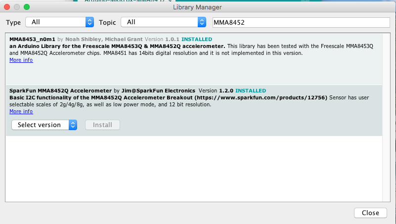
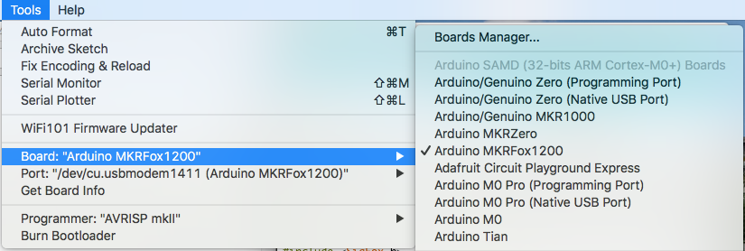
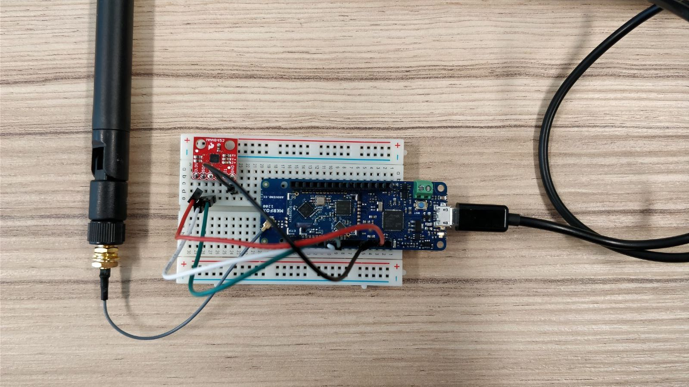
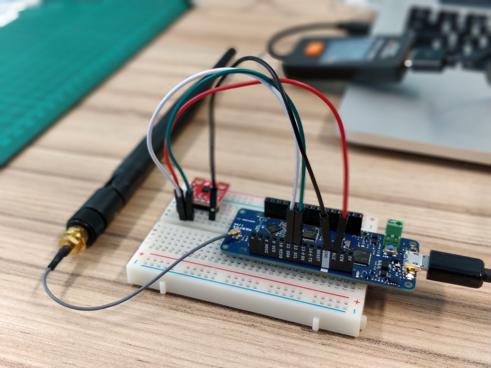

# Arduino-MKRFox-MMA8452

Earthquake detection project using an Arduino MKRFox and an accelerometer MMA8452 from Sparkfun

## Install libraries

* First install the MMA8452 library from Sparkfun

* Choose the Arduino MKRFox 1200 board

## Wire the board

